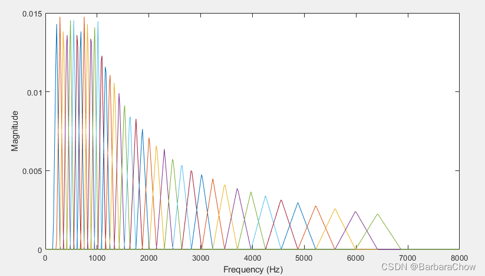
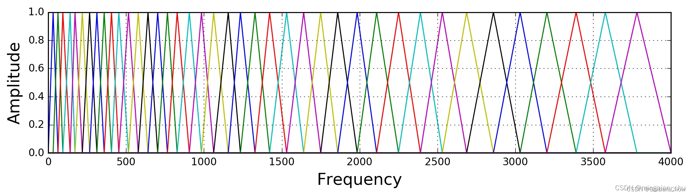

# MFCC梅尔倒谱系数（Mel-scale Frequency Cepstral Coefficients）
  
## 引言

在语音识别（Speech Recognition）和话者识别（Speaker Recognition）方面，最常用到的语音特征就是梅尔倒谱系数（Mel-scale Frequency Cepstral Coefficients，简称MFCC）。根据人耳听觉机理的研究发现，人耳对不同频率的声波有不同的听觉敏感度。从200Hz到5000Hz的语音信号对语音的清晰度影响对大。两个响度不等的声音作用于人耳时，则响度较高的频率成分的存在会影响到对响度较低的频率成分的感受，使其变得不易察觉，这种现象称为掩蔽效应。由于频率较低的声音在内耳蜗基底膜上行波传递的距离大于频率较高的声音，故一般来说，低音容易掩蔽高音，而高音掩蔽低音较困难。在低频处的声音掩蔽的临界带宽较高频要小。所以，人们从低频到高频这一段频带内按临界带宽的大小由密到疏安排一组带通滤波器，对输入信号进行滤波。将每个带通滤波器输出的信号能量作为信号的基本特征，对此特征经过进一步处理后就可以作为语音的输入特征。由于这种特征不依赖于信号的性质，对输入信号不做任何的假设和限制，又利用了听觉模型的研究成果。因此，这种参数比基于声道模型的LPCC相比具有更好的鲁邦性，更符合人耳的听觉特性，而且当信噪比降低时仍然具有较好的识别性能。

### （1）同态处理
同态处理，也叫同态滤波，是一种将卷积关系变换为求和关系的分离处理技术。数字信号处理领域有一项重要任务，即解卷积，即将参与卷积的各个分量分开。在语音信号处理中，解卷积有两种，一种是线性预测，另一种是同态处理。
大概步骤为：
f(x,y)→DFT→H(u,v)→log→(DFT)-1→exp→g(x,y)

### （2）离散余弦变换（Discrete Cosine Transform, DCT）
离散余弦变换经常用于信号处理和图像处理，用来对信号和图像进行有损数据压缩，这是由于离散余弦变换具有很强的"能量集中"特性：大多数的自然信号（包括声音和图像）的能量都集中在离散余弦变换后的低频部分，实际就是对每帧数据在进行一次降维。
对能量进行DCT变换。因为不同的Mel滤波器是有交集的，因此它们是相关的，我们可以用DCT变换去掉这些相关性，从而后续的建模时可以利用这一点(比如常见的GMM声学模型我们可以使用对角的协方差矩阵，从而简化模型)。

## MFCC基本概述

梅尔倒谱系数（Mel-scale Frequency Cepstral Coefficients，简称MFCC）是在Mel标度频率域提取出来的倒谱参数，Mel标度描述了人耳频率的非线性特性，它与频率的关系可用下式近似表示：

$Mel(f) = 2595 * lg(1+\frac{f}{700})$

呈现上为凸函数

### MFCC计算过程
流程图：
语音 -> 预加重 -> 分帧 -> 加窗 -> FFT -> Mel滤波 -> 对数变换 -> DCT

#### 1. 预处理

包括预加重、分帧、加窗

- (1) 预加重

    预加重的目的是提升高频部分，使信号的频谱变得平坦，保持在低频到高频的整个频带中，能用同样的信噪比求频谱。同时，也是为了消除发生过程中声带和嘴唇的效应，来补偿语音信号受到发音系统所抑制的高频部分，也为了突出高频的共振峰。预加重处理其实是将语音信号通过一个高通滤波器：

$ H(z) = 1 - \mu z^{-1}$

    时域表示形式：
$ y(n) = x(n) - \alpha x(n - 1)$

- (2) 分帧

    由于语音信号的非平稳特性 和 短时平稳特性，将语音信号分分帧。
    一帧有N个采样点，如N的值为256或512，涵盖的时间约为20~30ms左右。为了避免相邻两帧的变化过大，平缓过度，因此会让两相邻帧之间有一段重叠区域，此重叠区域包含了M个取样点，通常M的值约为N的1/2或1/3。通常语音识别所采用语音信号的采样频率为8KHz或16KHz，以8KHz来说，若帧长度为256个采样点，则对应的时间长度是256/8000×1000=32ms。

- （3）加窗

    为了缓解频谱泄露。将每一帧乘以一个窗函数，如汉明窗，海宁窗。假设分帧后信号为S(n)，n=0，1，...，N-1，N为帧的大小，那么乘上汉明窗W(n)：

$ S'(n) = S(n) \times W(n) $

#### 2. 频域变换及能量求取
- (1) FFT

    由于信号在时域上的变换通常很难看出信号的特性，所以通常将它转换为频域上的能量分布来观察，不同的能量分布，就能代表不同语音的特性。所以在乘上汉明窗后，每帧还必须再经过快速傅里叶变换以得到在频谱上的能量分布。对分帧加窗后的各帧信号进行快速傅里叶变换得到各帧的频谱。

$ X_a(k) = \sum_{n = 0}^{N - 1} x(n)e^{-j2\pi k/N}, 0 \leq k \leq N $

    式中x(n)为输入的语音信号，N表示傅里叶变换的点数。

- (2) 谱线能量

    对FFT后的频谱取模平方得到语音信号的谱线能量。

#### 3. 计算通过Mel滤波器的能量

将能量谱通过一组Mel尺度的三角形滤波器组，定义一个有M个滤波器的滤波器组（滤波器的个数和临界带的个数相近），采用的滤波器为三角滤波器，中心频率为f(m) 。M通常取22-26。各f(m)之间的间隔随着m值的减小而缩小，随着m值的增大而增宽，如图所示：

三角滤波器的频率响应定义为:

$$ 
H_m(k) = 
\begin{Bmatrix}
0, k < f(m - 1)\\
\frac{2(k - f(m - 1))}{(f(m + 1) - f(m - 1))(f(m) - f(m - 1))} , f(m - 1) \leq k \leq f(m)\\
\frac{2(f(m + 1) - k)}{(f(m + 1) - f(m - 1))(f(m) - f(m - 1))} , f(m) \leq k \leq f(m + 1)\\
0 , k \geq f(m+1)\\
\end{Bmatrix}
$$

三角带通滤波器主要有三个目的：

- 三角形是低频密、高频疏的，这可以模仿人耳在低频处分辨率高的特性；
- 对频谱进行平滑化，并消除谐波的作用，突显原先语音的共振峰。（因此一段语音的音调或音高，是不会呈现在 MFCC 参数内，换句话说，以 MFCC 为特征的语音辨识系统，并不会受到输入语音的音调不同而有所影响；在每个三角形内积分，就可以消除精细结构，只保留音色的信息）
- 还可以减少数据量，降低运算量。

计算每个滤波器组输出的对数能量为：

$ s(m) = ln(\sum_{k = 1}^{N - 1}|X_a(k)|^2H_m(k)) , 0 \leq m \leq M$

#### 深入内容：mel三角滤波的原理和设计

1. 为什么会产生Mel这种尺度机制

Mel就是单词Melody（调、旋律）的简称，根据人耳的听觉感知刻画频率。

- 人耳朵具有特殊的功能，可以使得人耳朵在嘈杂的环境中，以及各种变异情况下仍能正常的分辨出各种语音
- 其中，耳蜗有关键作用，耳蜗实质上的作用相当于一个滤波器组，耳蜗的滤波作用是在对数频率尺度上进行的，在1000HZ以下为线性尺度，1K HZ以上为对数尺度，使得人耳对低频信号敏感，高频信号不敏感。
例如，人们可以比较容易地发现500和1000Hz的区别，但很难发现7500和8000Hz的区别。

2. Mel刻度的定义：

$F_{mel}(f) = 2595 * lg(1+\frac{f}{700})$

$ f = 700(10^{\frac{m}{1595}} - 1) $

或

$F_{mel}(f) = 1125 * ln(1+\frac{f}{700})$

当频率较小，mel随Hz上升很快
当频率较大，mel上升缓慢。

一般用三角滤波来设计mel滤波器，三角是最常用的

如下图所示，40个三角滤波器组成滤波器组，低频处滤波器密集，门限值大，高频处滤波器稀疏，门限值低。恰好对应了频率越高人耳越迟钝这一客观规律。该滤波器形式叫做等面积梅尔滤波器（Mel-filter bank with same bank area），在人声领域（语音识别，说话人辨认）等领域应用广泛。

但是如果用到非人声领域，常用的就是等高梅尔滤波器组（Mel-filter bank with same bank height），如下图：

3. mel滤波器的实现：

(1) 确定最低频率（0Hz），最高频率（fs/2），mel滤波器个数M（如23）；

(2) 转换最低频率和最高频率的Mel(f)；

$ low = 0 $
$ high = 2595 * lg(1 + (fs / 2) / 700) $

(3) 计算相连两个Mel滤波器中心Mel频率的距离，在Mel频率上，两两之间的中心频率是等间距的；

$ d = (high - low) / M + 1 $ 

(4) 将每个中心Mel频率转化为频率f（非等间距）；

$ mel_{points} = linspace(low, high, nfilt(滤波器个数)) $

$ hz_{points} = 700 \times ( 10 ^ {\frac{mel_{points}}{2595}} - 1) $

(5) 计算频率所对应的FFT中点的下标；
$ bin = \frac{hz_{point}}{fs / 2} * (\frac{fft_{len}}{2} + 1) = \frac{(fft_{len} + 2) * hz_{point}}{fs}$

4. 对数能量取log，计算DCT倒谱

(1) 对能量取log
对于滤波器组的能量，我们对它取log。这也是受人类听觉的启发：人类对于声音大小(loudness)的感受不是线性的。为了使人感知的大小变成2倍，我们需要提高8倍的能量。这意味着如果声音原来足够响亮，那么再增加一些能量对于感知来说并没有明显区别。log这种压缩操作使得我们的特征更接近人类的听觉。为什么是log而不是立方根呢？因为log可以让我们使用倒谱均值减(cepstral mean subtraction)这种信道归一化技术（这可以归一化掉不同信道的差别）。

(2) DCT
经离散余弦变换（DCT）得到MFCC系数 :

$ C(n) = \sum_{m = 0}^{n - 1} s(m)cos(\frac{\pi n(m-0.5)}{M}), n = 1, 2, ..., L $ 

将上述的对数能量带入离散余弦变换，求出L阶的Mel参数。L阶指MFCC系数阶数，通常取12-16。这里M是三角滤波器个数。

#### Deltas和Delta-Deltas特征
Deltas和Delta-Deltas通常也叫(一阶)差分系数和二阶差分(加速度)系数。MFCC特征向量描述了一帧语音信号的功率谱的包络信息，但是语音识别也需要帧之间的动态变化信息，比如MFCC随时间的轨迹，实际证明把MFCC的轨迹变化加入后会提高识别的效果。因此我们可以用当前帧前后几帧的信息来计算Delta和Delta-Delta：

$ d_t = \frac{\sum_{n = 1}^{N} n(c_{t + n} - c_{t - n})}{2 \sum_{n = 1}^{n} N^2} $

上式得到的dt是Delta系数，计算第t帧的Delta需要t-N到t+N的系数，N通常是2。如果对Delta系数dt再使用上述公式就可以得到Delta-Delta系数，这样我们就可以得到3*12=36维的特征。上面也提到过，我们通常把能量也加到12维的特征里，对能量也可以计算一阶和二阶差分，这样最终可以得到39维的MFCC特征向量。